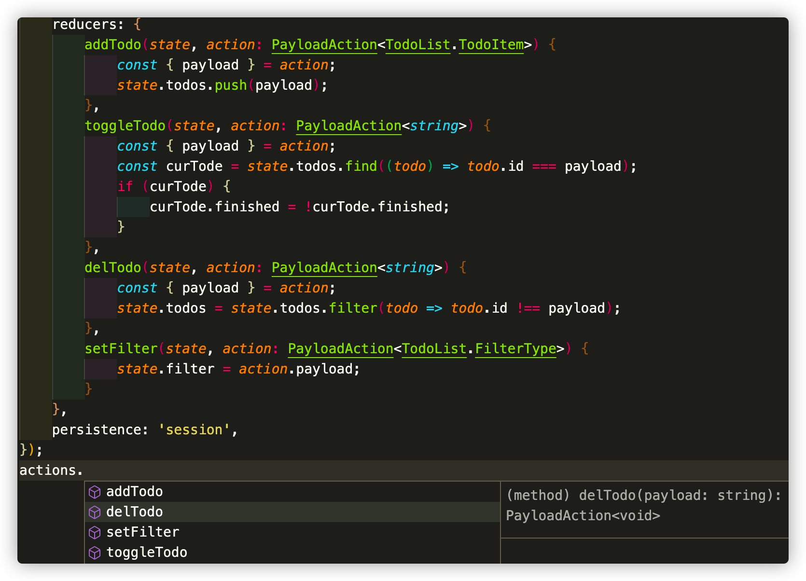

# 定义 Model 

首先，我们先简单分析一下 todo-list 的功能来确定我们需要用到那些数据类型
- 每一个待办项都有一个文本值以及一个唯一id
- 每一个待办项需要有个字段来标识完成状态(已完成或未完成)
- 待办列表需要有一个过滤器，通过完成状态来过滤列表项

## ✏️ 使用 Ts 定义数据类型


```ts title=src/todo-list/model.ts
export namespace TodoList {
    export type TodoItem = { id: string; finished: boolean; text: string; }
    export type FilterType = 'all'|'unfinished'|'finished';
    export interface State {
        todos: TodoItem[],
        filter: FilterType,
    }
}
```

## 🤖 创建 Model

```ts title=src/todo-list/model.ts
import { createModel, PayloadAction } from "react-ducky";

const initialState:TodoList.State = { 
    todos: [],
    filter: 'all',
}

const { actions, reducer, getState, useModel } =  createModel({
    name: "todo",
    initialState,
    reducers: {
        /**
         * 添加一个待办
         */
        addTodo(state, action: PayloadAction<TodoList.TodoItem>) {
            const { payload } = action;
            state.todos.push(payload);
        },
        /**
         * 转换一个待办的完成状态
         */
        toggleTodo(state, action: PayloadAction<string>) {
            const { payload } = action;
            const curTode = state.todos.find((todo) => todo.id === payload);
            if (curTode) {
                curTode.finished = !curTode.finished;
            }
        },
        /**
         * 删除一个待办
         */
        delTodo(state, action: PayloadAction<string>) {
            const { payload } = action;
            state.todos = state.todos.filter(todo => todo.id !== payload);
        },
        /**
         * 修改代表列表的筛选条件
         */
        setFilter(state, action: PayloadAction<TodoList.FilterType>) {
            state.filter = action.payload;
        }
    },
    /**
     * 使用 localstrage 作数据缓存
     */
    persistence: 'local',
});

export { actions, reducer, getState, useModel }
```
现在，你通过 createModel 方法得到了：
- 一个 reducer 函数，用于将你的 Model 连接到 redux 中
- 一个 getState 函数，调用该函数可以获取当前 Model 的最新状态值
- 一个 useModel 函数，用于组件内部监听当前 Model 的变化，并获取最新的状态值，它与 useSelector 类似，区别在于useSelector是全局的状态监听。
- 一个 actions 对象，对象上的每一个属性都是一个 actionsCreator 方法，它们与你调用 createModel 传入的 reducers 一一对应。且拥有强大的类型提醒功能。如下图



自此，你已经创建好了一个功能完整且拥有良好类型提醒的 Model，用来支持后续应用的开发。

## ✨ 更多

createModel 还有一些其他的特性，更详细的介绍请到 [API 文档](/docs/API-Reference/reducer-and-actions/createModel) 中查看

## 🍀 参考

😇  `createModel` 的设计借鉴了:
- [Dva](https://dvajs.com/guide/concepts.html#models) 的 model 写法。
- [redux-toolkits](https://redux-toolkit.js.org/api/createSlice) 的 `creaetSlice` API。

